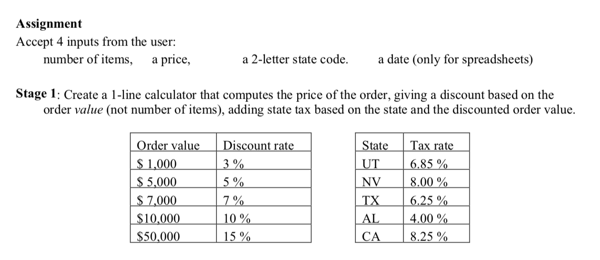

# Simple retail calculator

## Good for practicing

- Programming in JavaScript
- Object oriented or functional programming
- TDD
- Pair programming

## Challenge

This kata is based on the [Elephant Carpaccio exercise](http://alistair.cockburn.us/Elephant+Carpaccio+exercise).

## Usage

1. Run `npm install` to install dependencies.

3. Run `npm test kata` to run the unit tests.

4. Add your test cases to `test.js` and your calculator implementation to `index.js`.
